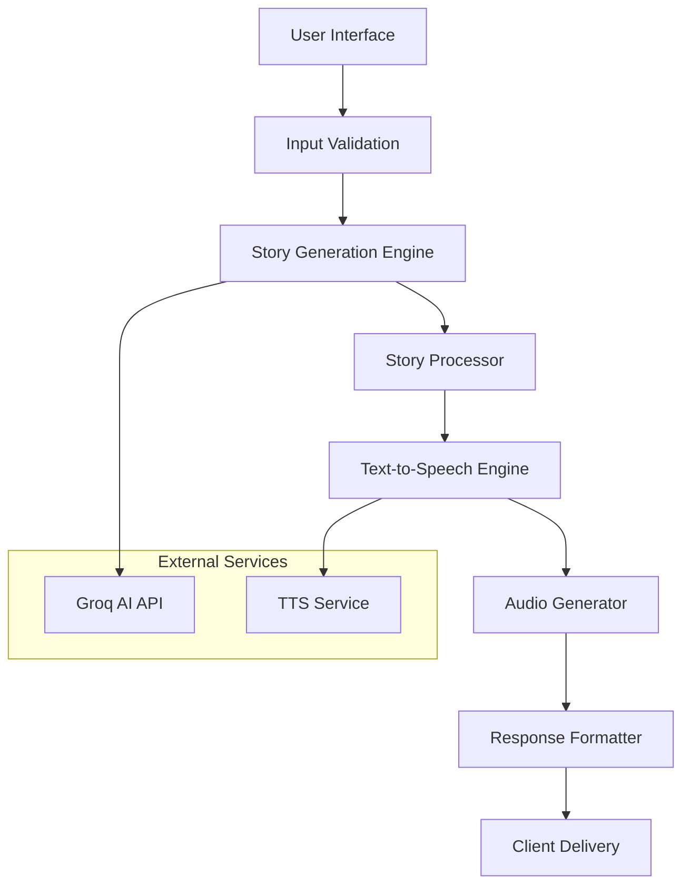

# 📖 CityGPT Documentation

<div align="center">

**Complete Guide to CityGPT - AI Story Generator**

*Transform your imagination into magical audio stories*

[🏠 Back to README](README.md) • [🚀 Live Demo](https://citygpt.vercel.app) • [🐛 Issues](https://github.com/Debanga-06/CityGPT/issues)

</div>

---

## 📋 Table of Contents

1. [Getting Started](#-getting-started)
2. [User Guide](#-user-guide)
3. [Technical Architecture](#-technical-architecture)
4. [API Configuration](#-api-configuration)
5. [Development Setup](#-development-setup)
6. [Deployment Guide](#-deployment-guide)
7. [Troubleshooting](#-troubleshooting)
8. [Contributing](#-contributing)
9. [FAQ](#-faq)

---

## 🚀 Getting Started

### What is CityGPT?

CityGPT is an AI-powered story generator that creates personalized audio narratives set in cities around the world. Using advanced language models from Groq, it generates contextual stories based on your chosen city, mood, and language preferences.

### Quick Start Guide

1. **Visit the Application**: Go to [citygpt.vercel.app](https://citygpt.vercel.app)
2. **Choose Your City**: Enter or select a city (e.g., Paris, Tokyo, New York)
3. **Select Story Mood**: Pick from 7 available moods
4. **Choose Language**: Select from 10 supported languages
5. **Generate Story**: Click the generate button and wait for your personalized story
6. **Listen & Enjoy**: Play the generated audio story

---

## 📖 User Guide

### City Selection

**Popular Cities Available:**
- 🗼 **Paris** - Romantic city of lights
- 🏯 **Tokyo** - Modern metropolis with traditional charm
- 🗽 **New York** - The city that never sleeps
- 🏰 **London** - Historic capital with royal heritage
- 🕌 **Mumbai** - Vibrant heart of India
- 🌉 **San Francisco** - Tech hub by the bay
- 🏛️ **Rome** - Eternal city of history
- 🌆 **Dubai** - Futuristic desert oasis

**Custom Cities:**
You can also enter any city name, and CityGPT will generate stories based on that location's characteristics and culture.

### Story Moods Explained

| Mood | Description | Example Story Elements |
|------|-------------|----------------------|
| 💕 **Romantic** | Love stories, heartwarming tales | Couples, dates, weddings, proposals |
| ⚡ **Adventurous** | Action-packed journeys | Quests, exploration, challenges |
| 🔮 **Mysterious** | Suspenseful narratives | Secrets, puzzles, unknown elements |
| 🎉 **Exciting** | High-energy stories | Celebrations, parties, thrilling events |
| 🕊️ **Peaceful** | Calm, soothing tales | Nature, meditation, quiet moments |
| ✨ **Magical** | Fantasy and enchanting stories | Magic, fantasy creatures, wonder |
| 🎢 **Thrilling** | Edge-of-your-seat excitement | Suspense, adrenaline, intense moments |

### Language Support

**Supported Languages:**
- 🇺🇸 **English** - Global lingua franca
- 🇮🇳 **Hindi** - Most spoken language in India
- 🇧🇩 **Bengali** - Rich literary tradition
- 🇩🇪 **German** - European business language
- 🇮🇹 **Italian** - Language of art and culture
- 🇵🇹 **Portuguese** - Spoken in Brazil and Portugal
- 🇷🇺 **Russian** - Eastern European and Central Asian
- 🇯🇵 **Japanese** - East Asian cultural powerhouse
- 🇰🇷 **Korean** - Growing global influence
- 🇨🇳 **Chinese** - Most spoken language worldwide

---

## 🏗️ Technical Architecture

### System Overview



### Technology Stack

**Frontend Framework:**
- **React/Next.js** - Component-based UI framework
- **JavaScript/TypeScript** - Modern programming languages
- **HTML5 Audio API** - Native audio playback
- **CSS3/Tailwind** - Responsive styling

**Backend Services:**
- **Groq API** - Advanced language model processing
- **Text-to-Speech** - Audio generation service
- **Vercel Edge Functions** - Serverless computing

**Infrastructure:**
- **Vercel** - Deployment and hosting platform
- **CDN** - Global content delivery
- **HTTPS** - Secure communication

### Data Flow

1. **Input Collection** - User selections (city, mood, language)
2. **Validation** - Input sanitization and validation
3. **AI Processing** - Groq API generates story content
4. **Audio Synthesis** - Text converted to speech
5. **Response Assembly** - Story and audio combined
6. **Delivery** - Content served to user interface

---

## ⚙️ API Configuration

### Environment Variables

Create a `.env.local` file in your project root:

```bash
# Required - Groq API Configuration
GROQ_API_KEY=your_groq_api_key_here

# Optional - Application Settings
NEXT_PUBLIC_APP_URL=http://localhost:3000
NODE_ENV=development

# Optional - Analytics and Monitoring
VERCEL_ANALYTICS_ID=your_analytics_id
```

### Groq API Setup

1. **Create Account**: Visit [console.groq.com](https://console.groq.com)
2. **Generate API Key**: Navigate to API Keys section
3. **Copy Key**: Add to your environment variables
4. **Test Connection**: Run the application to verify

### API Endpoints

**Internal Endpoints:**
- `POST /api/generate-story` - Main story generation
- `GET /api/health` - System health check
- `POST /api/validate-input` - Input validation

**Request Format:**
```json
{
  "city": "Paris",
  "mood": "romantic",
  "language": "english"
}
```

**Response Format:**
```json
{
  "success": true,
  "story": {
    "text": "Generated story content...",
    "audio_url": "https://audio-url.com/story.mp3",
    "metadata": {
      "duration": "120 seconds",
      "language": "english",
      "mood": "romantic"
    }
  }
}
```

---

## 💻 Development Setup

### Prerequisites

- **Node.js** v18 or higher
- **npm** or **yarn** package manager
- **Git** version control
- **Text Editor** (VS Code recommended)

### Local Installation

```bash
# 1. Clone the repository
git clone https://github.com/Debanga-06/CityGPT.git
cd CityGPT

# 2. Install dependencies
npm install
# or
yarn install

# 3. Set up environment variables
cp .env.example .env.local
# Edit .env.local with your API keys

# 4. Start development server
npm run dev
# or
yarn dev

# 5. Open in browser
# Navigate to http://localhost:3000
```

### Development Scripts

```bash
# Development
npm run dev          # Start development server
npm run build        # Build for production
npm run start        # Start production server
npm run lint         # Run ESLint
npm run test         # Run tests

# Utilities
npm run clean        # Clean build files
npm run analyze      # Bundle analysis
```

### File Structure

```
CityGPT/
├── pages/
│   ├── api/
│   │   └── generate-story.js
│   ├── _app.js
│   └── index.js
├── components/
│   ├── StoryGenerator.js
│   ├── AudioPlayer.js
│   └── LanguageSelector.js
├── styles/
│   └── globals.css
├── public/
│   └── assets/
├── utils/
│   ├── groq-client.js
│   └── validators.js
├── .env.local
├── package.json
└── README.md
```

---

## 🚀 Deployment Guide

### Vercel Deployment (Recommended)

1. **Connect Repository**:
   - Visit [vercel.com](https://vercel.com)
   - Import your GitHub repository
   - Configure project settings

2. **Environment Variables**:
   ```bash
   GROQ_API_KEY=your_production_key
   NODE_ENV=production
   ```

3. **Deploy**:
   - Push to main branch
   - Automatic deployment triggered
   - Monitor build logs

### Alternative Deployment Options

**Netlify:**
```bash
# Build command
npm run build

# Publish directory
out/
```

**Docker:**
```dockerfile
FROM node:18-alpine
WORKDIR /app
COPY package*.json ./
RUN npm install
COPY . .
RUN npm run build
EXPOSE 3000
CMD ["npm", "start"]
```

---

## 🔧 Troubleshooting

### Common Issues

**Issue: API Key Not Working**
```bash
Error: Invalid API key or quota exceeded
```
**Solution:**
- Verify GROQ_API_KEY in environment variables
- Check API key validity on Groq console
- Ensure sufficient API credits

**Issue: Audio Not Playing**
```bash
Error: Audio element cannot play provided source
```
**Solution:**
- Check browser audio permissions
- Verify TTS service is working
- Test with different browsers

**Issue: Slow Story Generation**
```bash
Warning: Story generation taking longer than expected
```
**Solution:**
- Check internet connection
- Verify Groq API status
- Consider implementing retry logic

### Debug Mode

Enable debug logging:
```bash
# Add to .env.local
DEBUG=true
LOG_LEVEL=verbose
```

### Performance Optimization

**Client-Side:**
- Implement loading states
- Add request caching
- Optimize audio compression

**Server-Side:**
- Use connection pooling
- Implement rate limiting
- Add response caching

---

## 🤝 Contributing

### Development Workflow

1. **Fork Repository**
2. **Create Feature Branch**
   ```bash
   git checkout -b feature/new-language-support
   ```
3. **Make Changes**
4. **Test Thoroughly**
5. **Submit Pull Request**

### Code Standards

**JavaScript/React:**
```javascript
// Use modern ES6+ syntax
const generateStory = async (params) => {
  try {
    const response = await groqClient.generate(params);
    return response.data;
  } catch (error) {
    console.error('Story generation failed:', error);
    throw error;
  }
};
```

**CSS/Styling:**
```css
/* Use meaningful class names */
.story-generator-container {
  max-width: 800px;
  margin: 0 auto;
  padding: 2rem;
}
```

### Testing Guidelines

**Unit Tests:**
```javascript
describe('Story Generator', () => {
  test('should generate story with valid inputs', async () => {
    const params = { city: 'Paris', mood: 'romantic', language: 'english' };
    const story = await generateStory(params);
    expect(story).toBeDefined();
    expect(story.text).toContain('Paris');
  });
});
```

---

## ❓ FAQ

### General Questions

**Q: Is CityGPT free to use?**
A: Yes, CityGPT is completely free and open source under MIT license.

**Q: How long does story generation take?**
A: Typically 15-30 seconds depending on story length and server load.

**Q: Can I use generated stories commercially?**
A: Yes, generated stories can be used freely for any purpose.

### Technical Questions

**Q: What AI model does CityGPT use?**
A: CityGPT uses Groq's advanced language models for story generation.

**Q: How do I add a new language?**
A: Languages are configured in the language selector component. Submit a PR with new language support.

**Q: Can I host CityGPT on my own server?**
A: Yes, follow the deployment guide for self-hosting instructions.

### Troubleshooting

**Q: Stories are not generating in my language**
A: Ensure the language is properly supported and configured in the language selector.

**Q: Audio quality is poor**
A: This may be due to TTS service limitations. Try different browsers or report the issue.

**Q: Can I customize story length?**
A: Currently, story length is automatically determined. Custom length feature is in the roadmap.

---

## 📞 Support

**Need Help?**
- 🐛 [Report Issues](https://github.com/Debanga-06/CityGPT/issues)
- 💬 [GitHub Discussions](https://github.com/Debanga-06/CityGPT/discussions)
- 📧 [Contact Developer](https://github.com/Debanga-06)
- 🌐 [Live Demo](https://citygpt.vercel.app)

---

<div align="center">

**📖 Documentation maintained by [Debanga-06](https://github.com/Debanga-06)**

*Last updated: July 2025*

[🏠 Back to README](README.md) • [⭐ Star on GitHub](https://github.com/Debanga-06/CityGPT)

</div>
