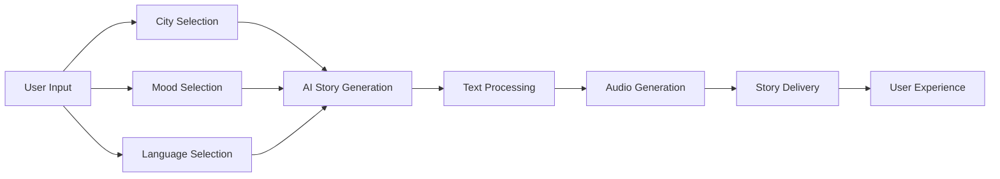

# 🏙️ CityGPT - AI Story Generator

<div align="center">

[](https://citygpt.vercel.app)
[](https://github.com/Debanga-06/CityGPT/stargazers)
[](https://github.com/Debanga-06/CityGPT/network)
[](LICENSE)

**🎧 Transform your imagination into magical audio stories**

*Experience cities around the world through AI-generated stories with immersive audio narration*

[🚀 Try Live Demo](https://citygpt.vercel.app) • [📖 Documentation](#documentation) • [🐛 Report Bug](https://github.com/Debanga-06/CityGPT/issues) • [💡 Request Feature](https://github.com/Debanga-06/CityGPT/issues)

</div>

---

## 🌟 What is CityGPT?

CityGPT is an innovative AI-powered story generator that creates personalized audio stories set in cities around the world. Simply choose a city, select your preferred mood, pick a language, and let our AI craft a unique narrative experience complete with professional audio narration.

### ✨ Key Features

🏙️ **City-Based Stories** - Stories set in famous cities like Paris, Tokyo, New York, London, Mumbai  
🎭 **Mood Selection** - Choose from 7 different story moods: Romantic, Adventurous, Mysterious, Exciting, Peaceful, Magical, Thrilling  
🌍 **Multi-Language Support** - Generate stories in 10 languages including English, Hindi, Bengali, German, Italian, Portuguese, Russian, Japanese, Korean, and Chinese  
🎧 **Audio Narration** - Every story comes with high-quality AI-generated audio narration  
⚡ **Real-Time Generation** - Stories are created instantly using advanced AI technology  
📱 **Responsive Design** - Works seamlessly across desktop, tablet, and mobile devices  

---

## 🚀 Live Demo

Experience CityGPT in action: **[citygpt.vercel.app](https://citygpt.vercel.app)**

### How to Use

1. **🏙️ Choose a City** - Select from popular cities or enter your own
2. **🎭 Select Story Mood** - Pick the emotional tone for your story
3. **🌍 Choose Language** - Select from 10 supported languages
4. **✨ Generate** - Click the generate button and wait for the magic
5. **🎧 Listen & Enjoy** - Play your personalized audio story

---

## 🛠️ Tech Stack

**Frontend:**
- React.js / Next.js
- Modern CSS / Tailwind CSS
- Responsive Web Design
- HTML5 Audio API

**AI & Audio:**
- Advanced Language Models (GPT-based)
- Text-to-Speech (TTS) Technology
- Natural Language Processing
- Multi-language AI Models

**Deployment:**
- Vercel (Frontend Hosting)
- Edge Functions for AI Processing
- CDN for Fast Global Delivery

**Languages Supported:**
- 🇺🇸 English
- 🇮🇳 Hindi  
- 🇧🇩 Bengali
- 🇩🇪 German
- 🇮🇹 Italian
- 🇵🇹 Portuguese
- 🇷🇺 Russian
- 🇯🇵 Japanese
- 🇰🇷 Korean
- 🇨🇳 Chinese

---

## 🎭 Story Moods

Our AI can generate stories in various emotional tones:

| Mood | Description | Perfect For |
|------|-------------|-------------|
| 💕 **Romantic** | Love stories and heartwarming tales | Date nights, couples |
| ⚡ **Adventurous** | Action-packed journeys and quests | Thrill seekers, gamers |
| 🔮 **Mysterious** | Suspenseful and intriguing narratives | Mystery lovers, puzzle enthusiasts |
| 🎉 **Exciting** | High-energy and dynamic stories | Party moods, celebrations |
| 🕊️ **Peaceful** | Calm and soothing narratives | Relaxation, bedtime stories |
| ✨ **Magical** | Fantasy and enchanting tales | Children, fantasy fans |
| 🎢 **Thrilling** | Edge-of-your-seat excitement | Adrenaline junkies, suspense lovers |

---

## 🏗️ How It Works



1. **Input Collection** - User selects city, mood, and language preferences
2. **AI Processing** - Advanced language models generate contextual stories
3. **Audio Synthesis** - Text-to-speech technology creates natural narration
4. **Real-time Delivery** - Story and audio are delivered instantly to the user

---

## 🌍 Featured Cities

CityGPT creates unique stories set in major cities worldwide:

**Popular Destinations:**
- 🗼 **Paris** - Romantic tales along the Seine
- 🏯 **Tokyo** - Modern adventures in neon-lit streets  
- 🗽 **New York** - Urban stories in the city that never sleeps
- 🏰 **London** - Historical narratives in foggy streets
- 🕌 **Mumbai** - Vibrant stories from the heart of India

*And many more cities to explore!*

---

## 🚀 Getting Started (Development)

### Prerequisites
- Node.js (v18 or higher)
- npm or yarn package manager
- API keys for AI services

### Installation

```bash
# Clone the repository
git clone https://github.com/Debanga-06/CityGPT.git
cd CityGPT

# Install dependencies
npm install

# Set up environment variables
cp .env.example .env
# Add your API keys and configuration

# Start development server
npm run dev

# Open http://localhost:3000
```

### Environment Variables

```bash
# AI Service Configuration
GROQ_API_KEY=your_groq_api_key

# Application Settings
NEXT_PUBLIC_APP_URL=http://localhost:3000
NODE_ENV=development

# Vercel Configuration (for deployment)
VERCEL_URL=your_vercel_deployment_url
```

---

## 📊 Performance & Features

- **⚡ Fast Generation** - Stories created in under 30 seconds
- **🎯 High Accuracy** - Contextually relevant city-based narratives  
- **🌐 Global Reach** - 10 language support with native speakers in mind
- **📱 Mobile Optimized** - Responsive design for all devices
- **🔊 Quality Audio** - Professional-grade text-to-speech narration
- **♿ Accessibility** - Built with web accessibility standards

---

## 🎯 Use Cases

### Entertainment
- **Personal Entertainment** - Generate unique stories for leisure
- **Travel Inspiration** - Discover cities through imaginative narratives
- **Language Learning** - Practice listening skills in different languages

### Education
- **Creative Writing** - Inspiration for writers and storytellers
- **Cultural Exploration** - Learn about cities through AI narratives
- **Language Practice** - Improve comprehension in foreign languages

### Accessibility
- **Audio Content** - Perfect for visually impaired users
- **Multitasking** - Listen while doing other activities
- **Bedtime Stories** - Peaceful mood stories for relaxation

---

## 👥 Development Team

**Developed entirely by:** [Debanga-06](https://github.com/Debanga-06)

**Special thanks to my amazing teammates for their support and collaboration:**
- **Subhadip Pal** - Thank you for your guidance and valuable insights throughout the development process! 🙏
- **Malay Pandey** - Appreciate your feedback and encouragement that helped make CityGPT even better! 🌟

*While the entire codebase was crafted by me, the success of this project wouldn't have been possible without the collaborative spirit and support of my incredible team!*

---

## 🤝 Contributing

We welcome contributions to make CityGPT even better! Here's how you can help:

### Ways to Contribute
- 🐛 **Bug Reports** - Found an issue? Let us know!
- 💡 **Feature Requests** - Have ideas for new features?
- 🌍 **Language Support** - Help us add more languages
- 🏙️ **City Additions** - Suggest new cities for stories
- 📚 **Documentation** - Improve our docs and guides

### Development Process
1. Fork the repository
2. Create a feature branch (`git checkout -b feature/amazing-feature`)
3. Make your changes and test thoroughly
4. Commit with descriptive messages (`git commit -m 'Add city: Barcelona'`)
5. Push to your branch (`git push origin feature/amazing-feature`)
6. Open a Pull Request with detailed description

---

## 📈 Roadmap

### 🎯 Coming Soon
- [ ] **Story Customization** - Add character names and personal details
- [ ] **Story Length Options** - Choose between short, medium, and long stories
- [ ] **Voice Selection** - Multiple narrator voices to choose from
- [ ] **Story History** - Save and revisit your favorite generated stories

### 🚀 Future Features
- [ ] **Interactive Stories** - Choose-your-own-adventure style narratives
- [ ] **Visual Elements** - AI-generated images to accompany stories
- [ ] **Social Sharing** - Share your favorite stories with friends
- [ ] **Premium Features** - Advanced customization and priority generation

### 🌟 Long-term Vision
- [ ] **Mobile App** - Native iOS and Android applications
- [ ] **API Access** - Public API for developers
- [ ] **Community Features** - User accounts and story collections
- [ ] **Educational Platform** - Integration with learning management systems

---

## 📄 License

This project is licensed under the MIT License - see the [LICENSE](LICENSE) file for details.

---

## 🙏 Acknowledgments

- **Groq** - For providing fast and efficient AI language model capabilities
- **Vercel** - For seamless deployment and hosting
- **Text-to-Speech Providers** - For high-quality audio generation
- **Beta Testers** - For valuable feedback and suggestions
- **Open Source Community** - For amazing tools and libraries

---

## 📞 Support & Contact

- **🌐 Live Demo:** [citygpt.vercel.app](https://citygpt.vercel.app)
- **📧 Email:** [Contact via GitHub](https://github.com/Debanga-06)
- **🐙 GitHub Issues:** [Report bugs or request features](https://github.com/Debanga-06/CityGPT/issues)
- **💬 Discussions:** [Join community discussions](https://github.com/Debanga-06/CityGPT/discussions)

---

## 🌟 Star History

[](https://star-history.com/#Debanga-06/CityGPT&Date)

---

<div align="center">

**🎧 Made with ❤️ for storytellers around the world**

**Experience the magic of AI storytelling - [Try CityGPT Now!](https://citygpt.vercel.app)**

⭐ **Star us on GitHub if CityGPT sparked your imagination!**

</div>
